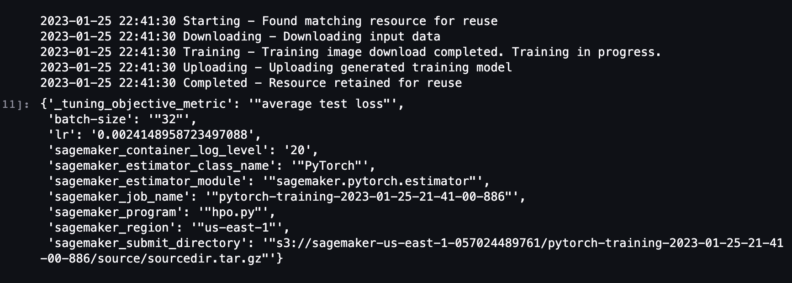
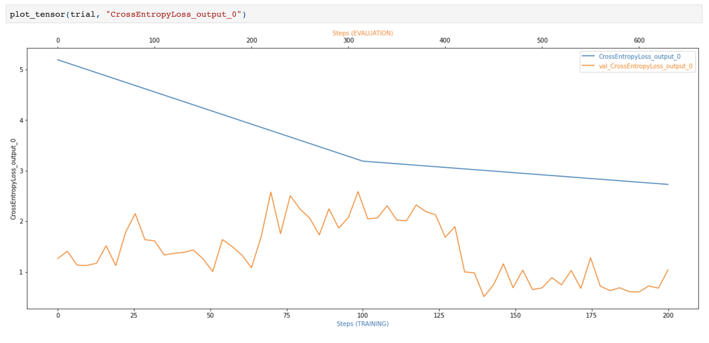
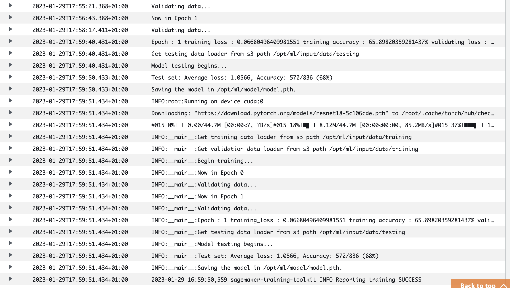
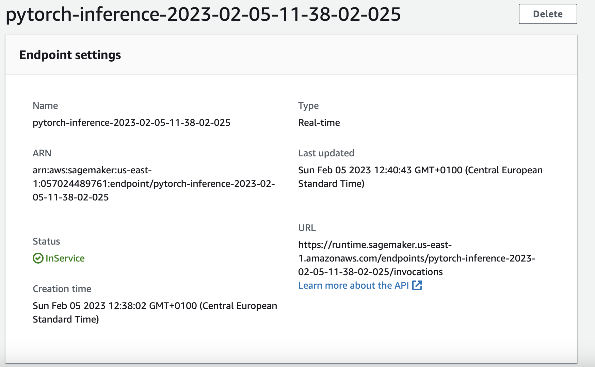

# Image Classification using AWS SageMaker

Use AWS Sagemaker to train a pretrained model that can perform image classification by using the Sagemaker profiling, debugger, hyperparameter tuning and other good ML engineering practices. This can be done on either the provided dog breed classication data set or one of your choice.

## Project Set Up and Installation
Enter AWS through the gateway in the course and open SageMaker Studio. 
Download the starter files.
Download/Make the dataset available. 

## Dataset
The provided dataset is the dogbreed classification dataset which can be found in the classroom.
The project is designed to be dataset independent so if there is a dataset that is more interesting or relevant to your work, you are welcome to use it to complete the project.

### Access
Upload the data to an S3 bucket through the AWS Gateway so that SageMaker has access to the data. 


Remember that your README should:
- Include a screenshot of completed training jobs
- Logs metrics during the training process
- Tune at least two hyperparameters
- Retrieve the best best hyperparameters from all your training jobs


## Hyperparameter Tuning

ResNet18, which is widely used in computer vision tasks, was chosen for this project. As it uses residual connections which bypasses information around the network, it is not prone to vanishing gradients and is known for better performance and faster convergence.

It was also chosen due to its computational efficiency, considering that the budget for this project is quite limited. 

With the need to be conservative in terms of memory and running expenses, the 2 hyperparameters, learning rate and batch size were chosen.

Learning rate has the potential to decrease the losses caused by a faster gradient descent. A learning rate that is too slow, however, can lead to the possibility of not reaching convergence.

Varying the batch size, on the other hand, may help with the non-uniform distribution of images for each class, however, may lead to poor generalization.

The ranges were chosen taking the details mentioned above into account, while considering time and limitations budget. 

Taking into account the batch sizes used for the training and that there are a total of 6683 images in my training data, it was necessary to run the training using parallel jobs. As epochs were not added to the hyperparameters to be tuned, the hyperparameter tuning instances consisted of multiple training jobs. 


**Initial Hyperparameters**

```python
hyperparameter_ranges = {
        "lr" : ContinuousParameter(0.001,0.1),
        "batch-size" : CategoricalParameter([32,64,128])
}
```




## Debugging and Profiling
**TODO**: Give an overview of how you performed model debugging and profiling in Sagemaker

The best hyperparameters that resulted from the hyperparameter tuning were used for the training model. Although the RESNET18 is less susceptible to vanishing gradients, it was still added as one of the rules for the model debugging configuration, along with overfitting and loss not decreasing. It was also configured to save the training interval every 100 steps and the evaluation interval every 10 steps. 

The reason for this is that there are more training samples than there are interval steps. Also, the smaller intervals in the evaluation data will magnify anomalies in the model's performance. 

To connect this to the train_and_deploy script, smdebug hooks were added to the script.

```python
hyperparameters = {"batch-size": 32, "lr": 0.0024148958723497088}

rules = [
    Rule.sagemaker(rule_configs.vanishing_gradient()),
    Rule.sagemaker(rule_configs.overfit()),
    Rule.sagemaker(rule_configs.loss_not_decreasing()),
    ProfilerRule.sagemaker(rule_configs.ProfilerReport()),
]
collection_configs=[
    CollectionConfig(name="CrossEntropyLoss_output_0",parameters={
                "include_regex": "CrossEntropyLoss_output_0", 
                "train.save_interval": "100","eval.save_interval": "10"})
]

profiler_config = ProfilerConfig(system_monitor_interval_millis=500, framework_profile_params=FrameworkProfile(num_steps=10))
debug_config = DebuggerHookConfig(collection_configs=collection_configs)
```

### Results
**TODO**: What are the results/insights did you get by profiling/debugging your model?

The training plot seems to have stopped too early and although the evaluation data showed a smaller loss, it is quite disturbing to see that the shape of the plot is not as smooth as could be expected. It seems that overfitting has occurred in this case. 

Looking into the profile report recommendations, it is quite evident that an increase in batch size is necessary to solve this problem. The profile report also suggests that an instance type of a lower capacity should be chosen. 

It also shows that the initializing and loading of data need to be optimized as it is taking too much time. 

**Cross Entropy Loss Ouput


**Cloudwatch Logs


**TODO** Remember to provide the profiler html/pdf file in your submission.
[Download Profiler-Report](https://d-5rhpy8nvi8bi.studio.us-east-1.sagemaker.aws/jupyter/default/files/CD0387-deep-learning-topics-within-computer-vision-nlp-project-starter/profiler-report.html?_xsrf=2%7Cc09a21ca%7Cf26e920073093e8351239024c7c11d63%7C1673450631)


## Model Deployment
**TODO**: Give an overview of the deployed model and instructions on how to query the endpoint with a sample input.

```python
model_location = "s3://sagemaker-us-east-1-057024489761/smdebugger-dogImages-pytorch-2023-01-29-14-54-24-918/output/model.tar.gz"

pytorch_model = PyTorchModel(model_data=model_location, 
                             role=get_execution_role(), 
                             entry_point='inference.py', 
                             py_version='py36', 
                             framework_version='1.8')

predictor = pytorch_model.deploy(initial_instance_count=1, instance_type='ml.m5.large')
```

To lower costs and to follow the recommendation in the profiler report, a lower instance type was chosen for the deployment of the model. 

An infernce.py script was created to facilitate model loading.

To solve the 'smdebug module not found' error that occurred during the endpoint invocation, installing smdebug was added to the model function in the script.

Another error that was encountered during enpoint invocation was 'resnet object has no copy attribute' after running the 'load_state_dict function call' in the model function.

**TODO** Remember to provide a screenshot of the deployed active endpoint in Sagemaker.




